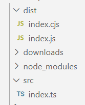
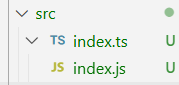

#### Initializin Node.js using NPM
```shell
npm init -y
```
#### Configure ECMA module
```json
  "type": "module",
```
#### Configure scripts
```json
"start:dev:js": "node src/index.js",
```
#### Installing Typescript
```prompt
npm install -D typescript
```
#### Create .gitignore
>Create .gitignore file and include "node_modules/" foder:\


#### Transpile index.ts and run index.js
```bash
npx tsc src/index.ts
npm run start:dev:js
```
 >#### Configure scripts for transpile index.ts and run index.js
>
> In package.json without "outDir" in "tsconfig.json"
>```json
>"dist": "npx tsc src/index.ts",
>"start:dev": "npm run dist && node src/index.js"
>```
> In package.json with "outDir" in "tsconfig.json"
>```json
>"dist": "npx tsc",
>"start:dev": "npm run dist && node src/index.js"
>```
> Create tsconfig.json
>```bash
>npx tsc --init
>```
> In tsconfig.json
>```json
> {
>  "compilerOptions": {
>    "module": "CommonJS",
>    "target": "ES6", 
>    "outDir": "./dist",
>    "esModuleInterop": true,
>    "strict": true
>  }
>}

> #### Installing tsx for run index.ts without compile
>
>```bash
>npm install tsx -D
>```
> In package.json
>```json
>"start:dev": "tsx src/index.ts"
>"start:watch": "tsx watch src/index.ts"
>"start:dist": "npm run dist && node src/index.js"
>```

> #### Intaling tsup for hidden *.js files
>```bash
>npm install tsup -D
>```
> In package.json
>```json
>"dist": "tsup src"
>```
>
>before tsup\
>
>
>after tsup\
>
>
>

